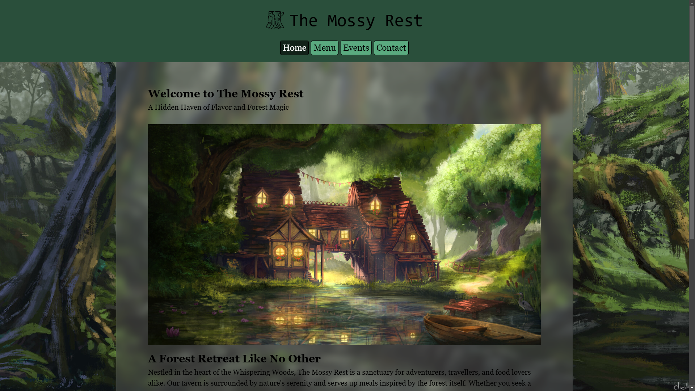
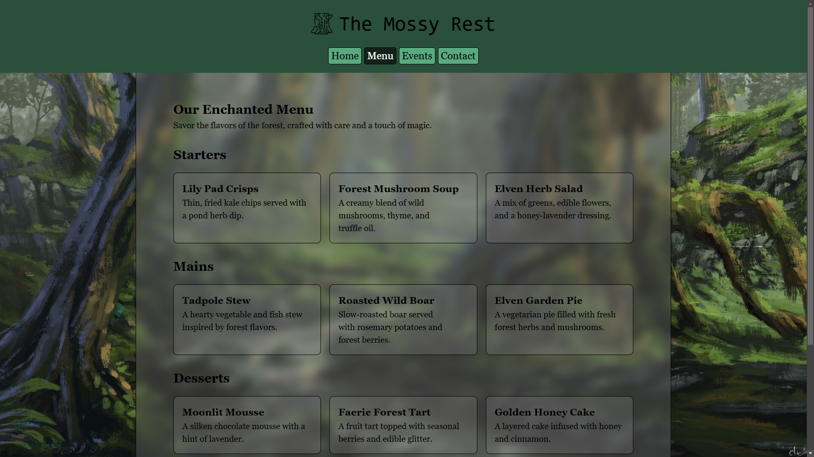

# Restaurant Homepage

Welcome to the Restaurant Homepage project! This application dynamically renders a restaurant homepage using JavaScript for DOM manipulation and uses Webpack for bundling.

## Live Demo

You can check out the live demo of the project here: [Live Demo](https://emre-oktay.github.io/restaurant-page/)

## Screenshots

Below are two screenshots of the restaurant homepage:

<div style="display: flex; gap: 10px">
  
  
</div>

## Setup and Installation

### Prerequisites

-   [Node.js](https://nodejs.org)
-   [npm](https://www.npmjs.com/)

### Installation

1. Clone the repository:

    ```bash
    git clone https://github.com/Emre-Oktay/restaurant-page.git
    cd restaurant-homepage
    ```

2. Install the dependencies:

    ```bash
    npm install
    ```

3. Start the development server:

    ```bash
    npx webpack serve
    ```

4. Open your browser and navigate to `http://localhost:8080`.

## Credits

-   Background image: [Guillermo Martínez](https://guimarguti.artstation.com/projects/bKam2n)

-   Tavern image: [Louisa Wilhelm](https://www.artstation.com/artwork/B1LW0k)

-   Logo: [Moss icon created by Freepik](https://www.flaticon.com/free-icon/moss_7922713?related_id=7922823&origin=search)
